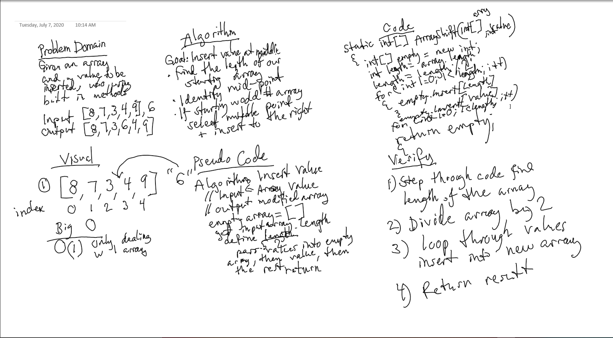

# data-structures-and-algorithms
This repository contains daily sets of code challenges for Code Fellows courses Code 301 and 401

401 Code Challenges Day 2
- [*] Top-level README “Table of Contents” is updated
- [*] Feature tasks for this challenge are completed
- [*] README for this challenge is complete
- [*] Summary, Description, Approach & Efficiency, Solution
- [*] Link to code - https://github.com/MRefvem/data-structures-and-algorithms
- [*] Picture of whiteboard
