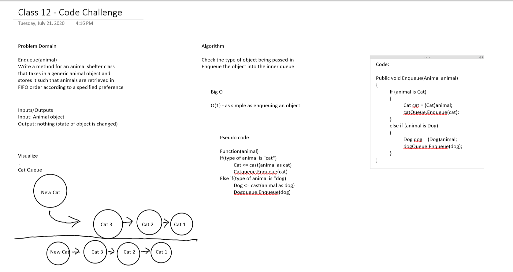

# Challenge Summary
Create a class called AnimalShelter which holds only dogs and cats. The shelter operates using a first-in, first-out approach.

## Challenge Description
The following methods are used:

### Queue:
- Enqueue(animal): which inserts value into the catQueue or dogQueue using a first-in, first-out approach.
- Dequeue(pref): which extracts a value from the catQueue or dogQueue, using a first-in, first-out approach.

## Approach & Efficiency
The approach is to turn out Enqueue and Dequeue methods that we're referring to from our library into generics so that we are able to pass in animal objects.

- Enqueue: O(1) efficiency because no matter what the same basic actions will repeat
- Dequeue: O(1) efficiency because no matter what the same basic actions will repeat

## Solution
