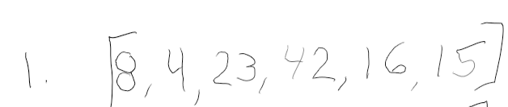
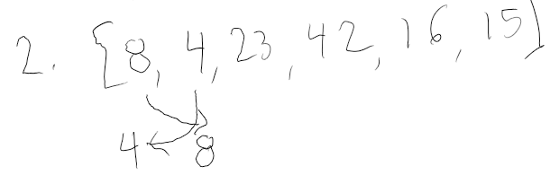
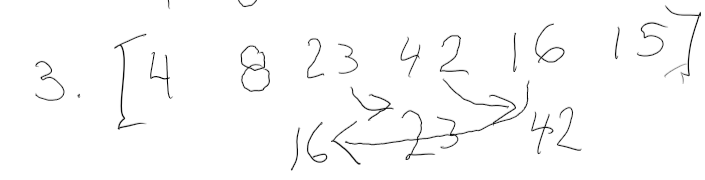
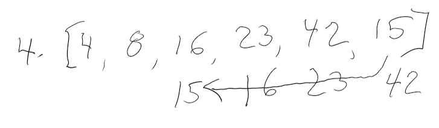
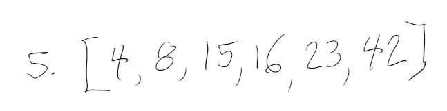

# Insertion Sort

## Description
Insertion sort iterates, consuming one input element each repetition, and growing a sorted output list. At each iteration, insertion sort removes one element from the input data, finds the location it belongs within the sorted list, and inserts it there. It repeats until no input elements remain.

Sorting is typically done in-place, by iterating up the array, growing the sorted list behind it. At each array-position, it checks the value there against the largest value in the sorted list. If larger, it leaves the element in place and moves it to the next. If smaller, it finds the correct position within the sorted list, shifts all the larger values up to make a space, and inserts into that correct position.

## Time and Efficiency
The average efficiency of insertion sort is an O(n2) operation, which is also the expected efficiency for worst-case scenario.

## Visual Process

1. Begin with an array you want to sort

2. Compare the values next to each other. If the value to the right is less than the value to the left, switch their positions.

3. The final sorted array

## Pseudo Code

  InsertionSort(int[] arr)
  
    FOR i = 1 to arr.length
    
      int j <-- i - 1
      int temp <-- arr[i]
      
      WHILE j >= 0 AND temp < arr[j]
        arr[j + 1] <-- arr[j]
        j <-- j - 1
        
      arr[j + 1] <-- temp
