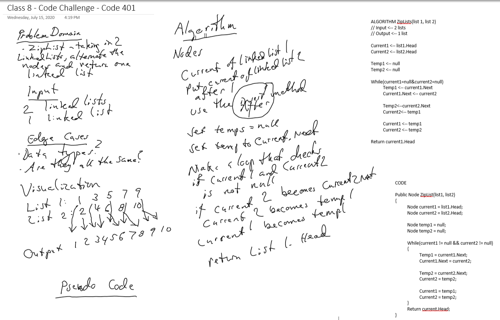

# Challenge Summary
A function called ZipLists which takes two linked lists as arguments. Zip the two linked lists together into one so that the nodes alternate between the two lists and return a reference to the head of the zipped list.

## Challenge Description
Creating method, ZipList.

## Approach & Efficiency
The approach was to break down all of the steps necessary to creating LinkedLists into little pieces, and imagining different methods that could go into creating and then modifying the lists

## Solution
