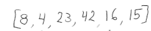
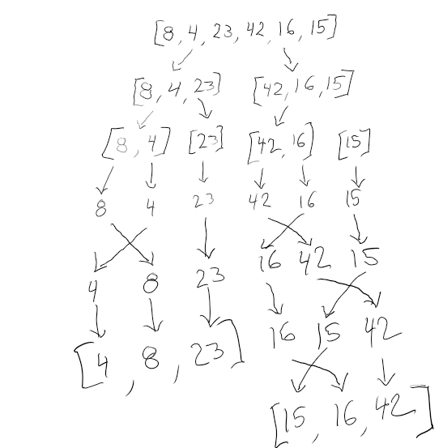
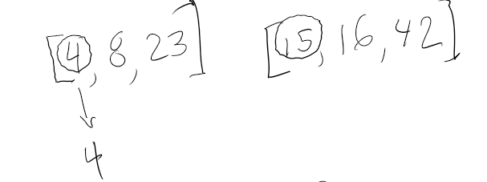
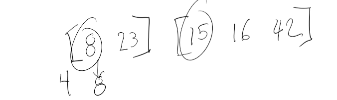
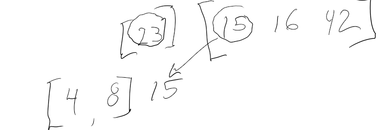
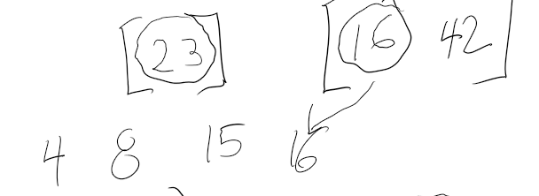
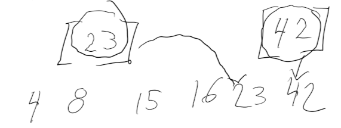
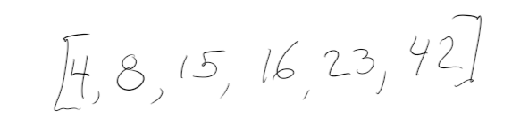

# Merge Sort

## Description
Merge sort is a recursive & divide-and-conquer algorithm. A divide and conquer algorithm works by recursively breaking down a problem into two or more sub-problems of the same or related type until these become simple enough to be solved directly.

## Time and Efficiency
The worst case efficiency of a merge sort operation is O(n log n).

## Visual Process

1. First divide the list into the smallest unit (1 element)

2. Compare each element with the adjacent list to sort and merge the two adjacent lists

3. All of the elements are sorted and merged

## Pseudo Code

ALGORITHM Mergesort(arr)
    DECLARE n <-- arr.length
           
    if n > 1
      DECLARE mid <-- n/2
      DECLARE left <-- arr[0...mid]
      DECLARE right <-- arr[mid...n]
      // sort the left side
      Mergesort(left)
      // sort the right side
      Mergesort(right)
      // merge the sorted left and right sides together
      Merge(left, right, arr)

ALGORITHM Merge(left, right, arr)
    DECLARE i <-- 0
    DECLARE j <-- 0
    DECLARE k <-- 0

    while i < left.length && j < right.length
        if left[i] <= right[j]
            arr[k] <-- left[i]
            i <-- i + 1
        else
            arr[k] <-- right[j]
            j <-- j + 1
            
        k <-- k + 1

    if i = left.length
       set remaining entries in arr to remaining values in right
    else
       set remaining entries in arr to remaining values in left
