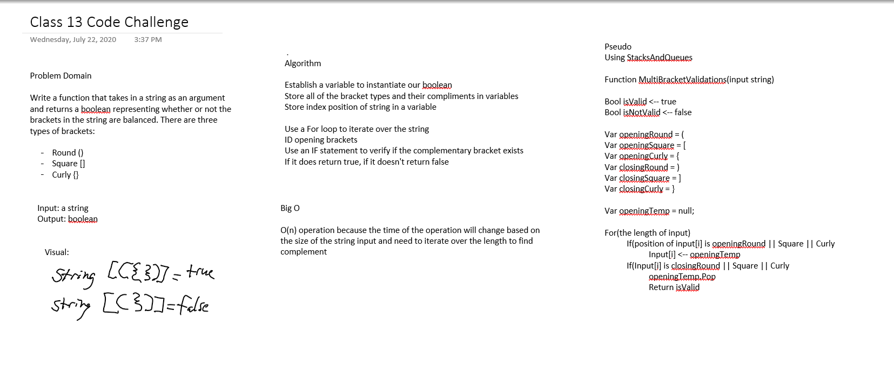

# Challenge Summary
Taking a string as an argument, return a boolean representing whether or not the brackets in the string are balanced. There are three types of brackets:

- Round Brackets: ()
- Square Brackets: []
- Curly Brackets: {}

## Challenge Description
Input, "{}", will evaluate as TRUE
Input, "{}(){}", will evaluate as TRUE
Input, "()[[Extra Characters]]", will evaluate as TRUE
Input, "(){}[[]]", will evaluate as TRUE
Input, "{}{Code}[Fellows](())", will evaluate as TRUE
Input, "[({}]", will evaluate as FALSE
Input, "(](", will evaluate as FALSE
Input, "{(})", will evaluate as FALSE

## Approach & Efficiency
This project uses my StacksAndQueues library as a reference.
The approach is to first define all of our opening and closing brackets as variables. We will evaluate the individual characters of the input string individually and every time we find an opening bracket, then put it into a temporary stack. Then every time we find a closing bracket, peek into the stack and see if the top value is the complimentary bracket. If it is, the pop the value off the stack. Continue until either the entire stack is empty or if there are remaining opening brackets. If the stack is empty, then return true.

- MultiBracketValidation: O(n) because the efficiency of the operation is determined by the length of the input string.

## Solution
