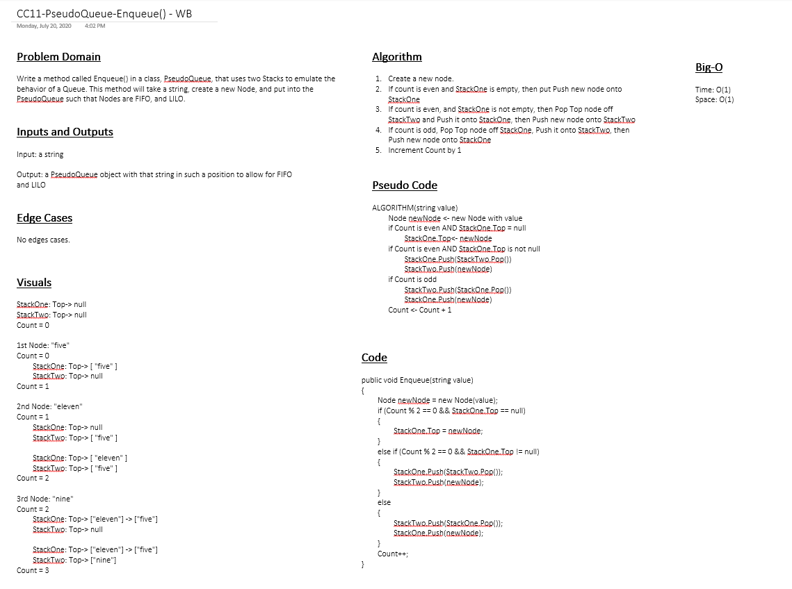

# Challenge Summary
While using a brand new PseudoQueue class, implement a standard queue interface but only utilize two stack objects.

## Challenge Description
The following methods are used to test the pseudo queue class:

### Queue:
- Enqueue: which inserts value into the PseudoQueue using a first-in, first-out approach.
- Dequeue: which extracts a value from the PseudoQueue, using a first-in, first-out approach.

## Approach & Efficiency
The approach was to define all of the classes and methods within and then run unit tests over the Library to make sure the logic was sound. Was able to import the data structure described in Stacks and Queues to help solve the problem.

- Enqueue: O(1) efficiency because no matter what the same basic actions will repeat
- Dequeue: O(1) efficiency because no matter what the same basic actions will repeat

## Solution
