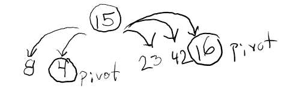

# Quick Sort 

## Description
Quick sort is a highly efficient sorting algorithm and is based on partitioning of array of data into smaller arrays. A large array is partitioned into two arrays one of which holds values smaller than the specified value, say pivot, based on which the partition is made and another array holds values greater than the pivot value.

## Time and Efficiency
The efficiency of a quick sort algorithm is typically an O(n log n) operation but in worse case scenarios it makes O(n2) comparisions.

## Visual Process

When presented with a list of numbers you want to sort through, the proper way to perform a quick sort algorithm is broken up into these steps:

1. Select the last element in the list (this becomes our "pivot element")

2. Every element with a lesser OR equal value to the pivot goes on the left side and every element with a greater value to the pivot goes on the right side

3. After the first iteration, you choose the element that is in the last position for each of the sublists and then do it again.

4. Perform this operation until you have separated each element into its own level

5.  When all of the elements have been separated, stack them all up in the order they are now in

6. The final result is the sorted list

## Pseudo Code

ALGORITHM QuickSort(arr, left, right)
    if left < right
        // Partition the array by setting the position of the pivot value 
        DEFINE position <-- Partition(arr, left, right)
        // Sort the left
        QuickSort(arr, left, position - 1)
        // Sort the right
        QuickSort(arr, position + 1, right)

ALGORITHM Partition(arr, left, right)
    // set a pivot value as a point of reference
    DEFINE pivot <-- arr[right]
    // create a variable to track the largest index of numbers lower than the defined pivot
    DEFINE low <-- left - 1
    for i <- left to right do
        if arr[i] <= pivot
            low++
            Swap(arr, i, low)

     // place the value of the pivot location in the middle.
     // all numbers smaller than the pivot are on the left, larger on the right. 
     Swap(arr, right, low + 1)
    // return the pivot index point
     return low + 1

ALGORITHM Swap(arr, i, low)
    DEFINE temp;
    temp <-- arr[i]
    arr[i] <-- arr[low]
    arr[low] <-- temp
