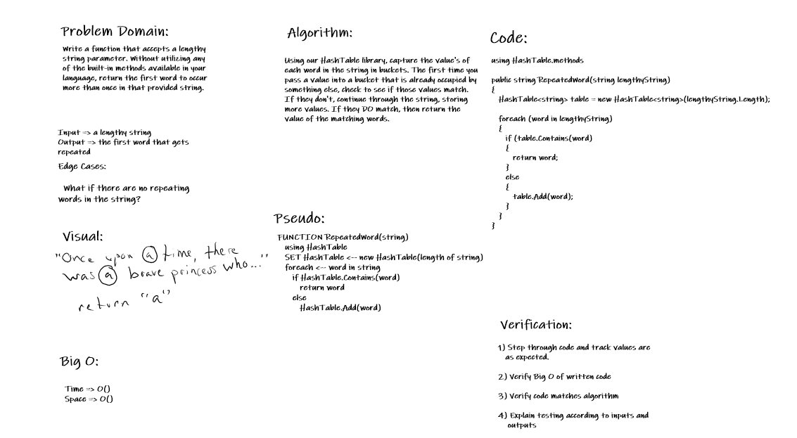

# RepeatedWord

401 Code Challenges Day 31 - RepeatedWord
- [*] Top-level README “Table of Contents” is updated
- [] Feature tasks for this challenge are completed
- [*] README for this challenge is complete
- [] Summary, Description, Approach & Efficiency, Solution
- [*] Link to code - https://github.com/MRefvem/data-structures-and-algorithms
- [*] Picture of whiteboard

## Challenge details
Write a function that accepts a lengthy string parameter.Without utilizing any of the built-in methods available to your language, return the first word to occur more than once in that provided string.

## Solution image - Whiteboard
