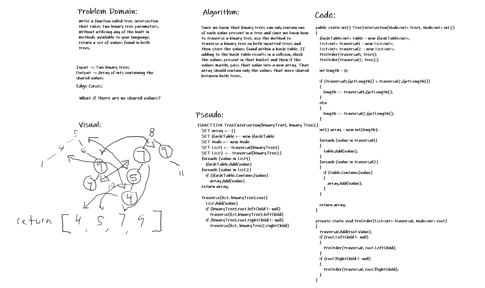

# TreeIntersection

401 Code Challenges Day 32 - TreeIntersection
- [*] Top-level README “Table of Contents” is updated
- [] Feature tasks for this challenge are completed
- [*] README for this challenge is complete
- [] Summary, Description, Approach & Efficiency, Solution
- [*] Link to code - https://github.com/MRefvem/data-structures-and-algorithms
- [*] Picture of whiteboard

## Challenge details
Write a function called tree_intersection that takes two binary tree parameters. Without utilizing any of the built-in library methods available in your language, return a set of values found in both trees.

## Solution image - Whiteboard
