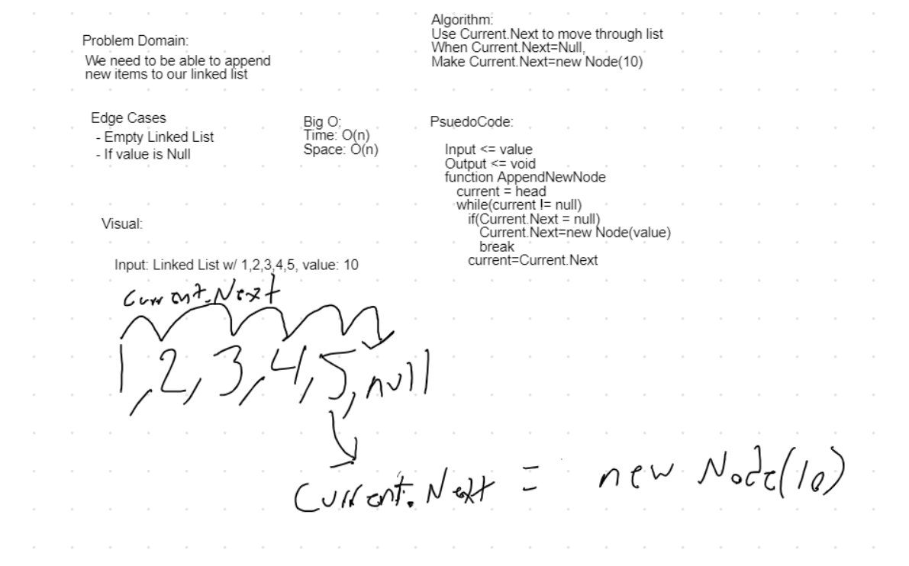

# Data Structure Summary
The purpose of this Code Challenges is to practice creating LinkedLists through a library and running UnitTests to check if the methods are sound.

## Data Structure Description
Creating methods, Append(value), InsertBefore(value, newVal), InsertAfter(value, newVal).

Creating method: FindKthFromTheEnd(key) - Iterate through the list and locate the node that is at the Kth position from the end of the list

## Approach & Efficiency
The approach was to break down all of the steps necessary to creating LinkedLists into little pieces, and imagining different methods that could go into creating and then modifying the lists

Insert: 0(1) efficiency because method doesn't need to iterate through the list to perform functionality
Includes: O(n) efficiency because using a while loop to iterate through the entire list to find specific value
ToString: O(n) efficiency because using a while loop to iterate through the entire list and build out the string
Append: O(n) efficiency becuase using a while loop to iterate through the list in order to find where Current.Next == null and then append new Node in place of Current.Next
InsertBefore: O(n) efficiency becuase uses a while loop to iterate through the list in order to find the node that correllates with value in order to insert new value before
InsertAfter: O(n) efficiency because uses a while loop to iterate through the list in order to find the node that correlates with value in order to insert new value after
FindKthFromTheEnd: O(n) efficiency because the method needs to iterate through the entire list to see where the end of the list is

## Solution

